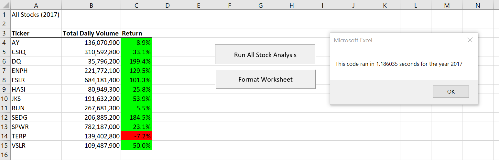
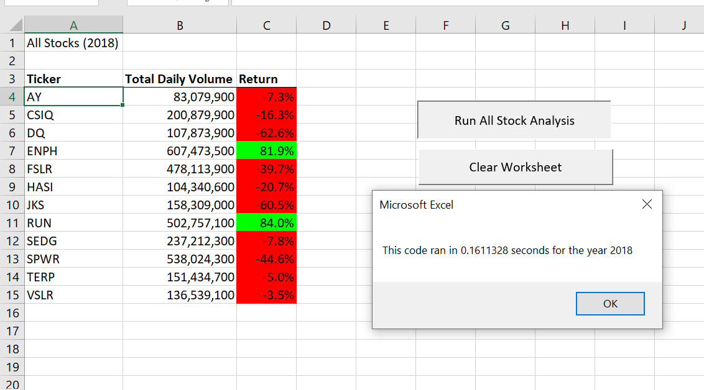

# Green Energy Stocks Analysis
## Overview of Project
Steve wants to help his parents to invest in stock market. Thay are passaionate about green energy that is why they are willing to invest their fund in green energy stocks. They have not done enough resaerch on stocks market and want to invest all their money in DAQO (DQ) stocks based on their experience with Dairy Queen ( totally irrelevant). The purpous of project is to help steve by analysing the stocks market of green energy to see whether DQ (DAQO) is the best option to invest all available fund in it, or it is better to diversifying the available fund between other green energy stocks.
## Results of Stock Performance Analysis
### Stock Permformance for 2017
Comparing the Return rate of different stocks in _2017_, almost all green energy stocks (except TERP with -7.2% return rate) had a higher stock appreciation by end of _2017_ and some of them such as DQ, ENPH, FSLR, and SEDG even returned gains having average annual returns of more than 100% of the initial start of year stock price. In terms of liquidity all the stocks seem to have a large volume of shares traded in _2017_. With considering both return and daily volume of shares traded in only _2017_, it seems to be logical to invest in green energy stocks and investors would gain an average more than 50% of their shares.
### Stock Permformance for 2018
However, in _2018_ the return rate for almost all of the stocks depreciated, which shows instability, flactuation and high rate of risk for investors in this industry stocks. In the particular case of DQ, eventhough the daily volume of shares traded increased by almost 3 times, the return rate of -62% which is the lowest of all, does not seem to be a good investment for investors and also Steve's parents. Although for ENPH after dropping the return rate form 129% to 81% and for RUN increasing from 5% to 84% also appreciation in daily volumes from _2017_ to _2018_, they seem to be a better fit to invest in green energy stocks.
### Stock Performance Analysis Conclusion 
By comparing each ticker between _2017_ and _2018_, it can be realizaed that the daily volume of each ticker is not a reliable factor to analyze the stock market. In adition, to fully understand the stock market, a year of data can not be sufficent. For instance in this Data Set, base on the daily volumes and return rates in _2017_, green energy stocks seem to be a great investment, but after _2018_ data added to the analysis process we can cleary recognize that the flactuion of the return rate for most of the stocks and daily volume for some of them the green energy stocks is not a stable market to invest all Steve's parents'fund.
### Time Execution Analysis
The execution time for _Original Script_ of VBA for _2017_ is _84458.17_ seconds and in _2018_ it is _84614.85_ seconds. But _Rafactored Script_ for _2017_ and _2018_ ran in _1.328125_ and _1.023438_ seconds respectively, which shows code refactoring can be beneficial in terms of **time**. 

**Figure 1**: Time execution and Stock Performance for _2017_ in Refactored Script

**Figure 2**: Time execution and Stock Performance for _2018_ in Refactored Script

## Summary:
## Advantages and Disadvantages of refactoring code
### Advantages
1) The Macro runs faster after refactoring the script.
2) It is more organized, readable, and easier to find the reason behind each line of code 
3) It makes the script maintainable and less expensive for future adjustments
### Disadvantages
1) In big Data it can be risky and expensive 
2) It may cause bugs in the script
3) It may be time consuming to refactor code scripts written by someone else
## Pros and Cons of refactoring the original VBA script
Refactoring the original VBA script was time consuming, it caused some bugs in the script. However at the end it made the Macro faster and efficient, the script became more readalbe for furthur modification. In addition it increased the maintainability of the script. 
