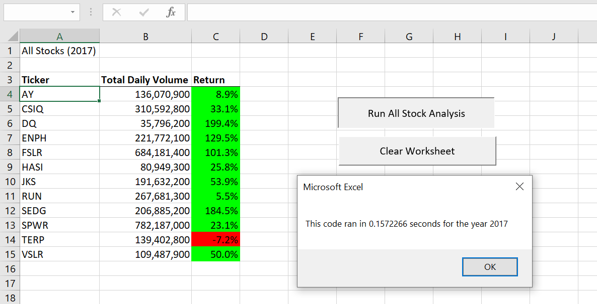

# Stock Market Analysis
## Overview of Project
Steve wants to help his parents to invest in stock market. Thay are passaionate about green energy that is why they are willing to invest their fund in green energy stocks. They have not done enough resaerch on stocks market and want to invest all their money in DAQO (DQ) stocks based on their experience with Dairy Queen ( totally irrelevant). The purpous of project is to help steve by analysing the stocks market of green energy to see whether DQ (DAQO) is the best option to invest all available fund in it, or it is better to diversifying the available fund between other green energy stocks.
## Results of Stock Performance Analysis
### Stock Permformance for 2017
Comparing the Return rate of different stocks in 2017 Almost all green energy market stocks (except TERP which had -7.2% return rate) had a higher stock appreciation by end of 2017 and some of them such as DQ, ENPH, FSLR, and SEDG even returned gains having average annual returns of more than 100% of the initial start of year stock price. In terms of liquidity all the stocks seem to have a large volume of shares traded in 2017 which shows that investing in green energy stocks would not be a bad idea and investors would gain an average more than 50% of their shares.
### Stock Permformance for 2018
By end of 2018 the return rate for many of stocks depreciated which shows instability, flactuation and high rate of risk for investors. In the particular case of DQ eventhough the daily volume of shares traded increased by almost 3 times, the return rate of -62% which is the lowest of all, does not seem to be good investment for investors and also Steve's parents. Although for ENPH after dropping the return rate form 129% in 2017 to 81% in 2018 and RUN from 5% to 84% seem to be a better fit to invest in green energy stocks.
### Time Execution Analysis
The execution time for original script of VBA for 2017 is 84458.17 seconds and in 2018 it is 84614.85 seconds. But the rafactored script for 2017 and 2018 ran in 1.328125 and 1.023438 seconds.

Figure 1: Time execution and Stock Performance for 2017 in Refactored Script

Figure 2: Time execution and Stock Performance for 2018 in Refactored Script

## Summary:
## Advantages and Disadvantages of refactoring code
### Advantages
1) The Macro runs faster after refactoring the script.
2) It is more organized, readable, and easier to find the reason behind each line of code 
3) It makes the script maintainable and less expensive for future adjustments
### Disadvantages
1) In big Data it can be risky and expensive 
2) It may cause bugs in the script
3) It may be time consuming to refactor code scripts written by someone else
## Pros and Cons of refactoring the original VBA script
Refactoring the original VBA script was time consuming, it caused some bugs in the script. However at the end it made the Macro faster and efficient, the script became more readalbe for furthur modification. In addition it increased the maintainability of the script. 
